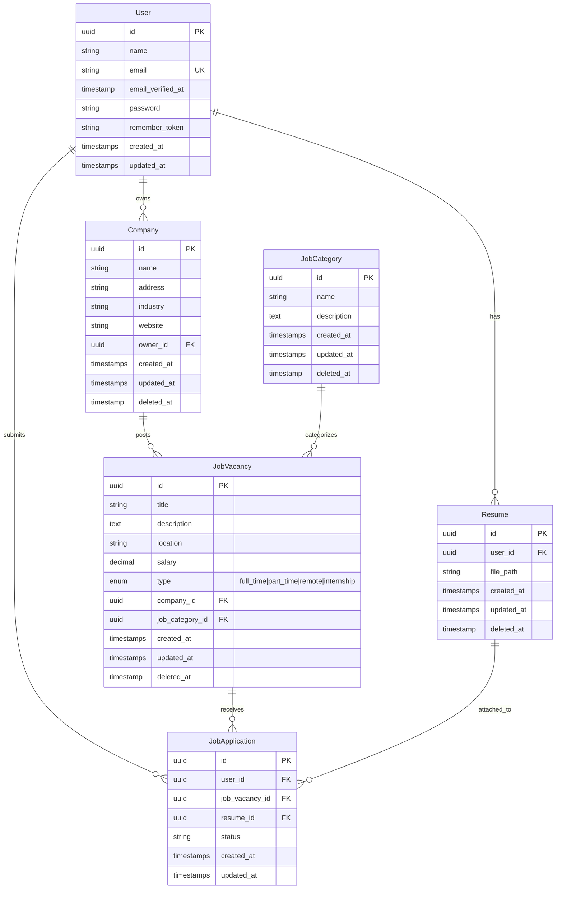

<p align="center">
  
  
  
  
  
</p>

<h1 align="center">🚀 Enterprise Job Board Platform</h1>

<p align="center">
  <strong>A scalable, modular monorepo architecture for a complete job board solution</strong>
</p>

<p align="center">
  <em>Built with separation of concerns, featuring distinct Candidate Portal & Admin Backoffice applications</em>
</p>

---

## 📑 Table of Contents

- [🎯 Overview](#-overview)
- [🏗️ System Architecture](#️-system-architecture)
- [🗂️ Project Structure](#️-project-structure)
- [📊 Entity Relationship Diagram](#-entity-relationship-diagram)
- [💻 Technical Stack](#-technical-stack)
- [⚡ Quick Start](#-quick-start)
- [🔧 Installation & Setup](#-installation--setup)
- [🌐 Environment Variables](#-environment-variables)
- [🔑 Key Features](#-key-features)
- [🛤️ Key Routes & API Endpoints](#️-key-routes--api-endpoints)
- [🖼️ Visuals & Screenshots](#️-visuals--screenshots)
- [🧪 Quality Assurance](#-quality-assurance)
- [📁 Directory Structure](#-directory-structure)
- [🚀 Deployment](#-deployment)
- [🤝 Contributing](#-contributing)
- [📄 License](#-license)

---

## 🎯 Overview

The **Enterprise Job Board Platform** is a production-ready recruitment solution engineered with a focus on **separation of concerns** and **scalability**. This monorepo houses two independent Laravel applications that share a cohesive ecosystem while maintaining strict logical separation between:

- **Candidate-facing portal** for job discovery and applications
- **Administrative backoffice** for recruiters and platform managers

> [!IMPORTANT]
> This platform uses **UUID-based primary keys** for all entities, ensuring distributed system compatibility and enhanced security.

---

## 🏗️ System Architecture

The platform is architected as **two independent Laravel 12.x applications**:

```
┌─────────────────────────────────────────────────────────────────────┐
│                     Job Board Platform (Monorepo)                    │
├─────────────────────────────────┬───────────────────────────────────┤
│        🌐 Candidate Portal      │      🛡️ Admin Backoffice          │
│           (job-app)             │        (job-backoffice)           │
├─────────────────────────────────┼───────────────────────────────────┤
│ • Job Discovery & Search        │ • Company/Recruiter Management    │
│ • Application Submission        │ • Application Tracking System     │
│ • Profile & Resume Management   │ • Job Vacancy CRUD                │
│ • Authentication (Candidates)   │ • Category & Taxonomy Management  │
│ • Application History           │ • Database Seeding & Admin Tools  │
└─────────────────────────────────┴───────────────────────────────────┘
                                  │
                                  ▼
                    ┌─────────────────────────┐
                    │     Shared Database     │
                    │   (MySQL / MariaDB)     │
                    └─────────────────────────┘
```

### 🌐 Candidate Portal (`/job-app`)

A responsive, user-centric frontend designed for high traffic and engagement.

| Feature | Description |
|---------|-------------|
| **Job Discovery** | Advanced search and filtering capabilities for job vacancies |
| **Application Logic** | Secure handling of resume uploads and job applications |
| **Profile Management** | Self-service dashboard for personal data and application history |
| **Authentication** | Session-based auth via Laravel Breeze |

### 🛡️ Admin Backoffice (`/job-backoffice`)

A restricted-access administrative panel for recruiters and platform managers.

| Feature | Description |
|---------|-------------|
| **Tenant Management** | Full CRUD operations for Companies and Recruiters |
| **ATS Features** | Application Tracking System to review, accept, or reject submissions |
| **Taxonomy Management** | Dynamic control over Job Categories and Attributes |
| **Data Seeding** | Built-in mechanisms to populate the database with initial data |

---

## 🗂️ Project Structure

```
job-board-platform/
├── 📂 job-app/                    # Candidate Portal Application
│   ├── app/
│   │   ├── Http/Controllers/
│   │   │   ├── Auth/              # Authentication controllers
│   │   │   │   ├── AuthenticatedSessionController.php
│   │   │   │   ├── ConfirmablePasswordController.php
│   │   │   │   ├── EmailVerificationNotificationController.php
│   │   │   │   ├── EmailVerificationPromptController.php
│   │   │   │   ├── NewPasswordController.php
│   │   │   │   ├── PasswordController.php
│   │   │   │   ├── PasswordResetLinkController.php
│   │   │   │   ├── RegisteredUserController.php
│   │   │   │   └── VerifyEmailController.php
│   │   │   ├── Controller.php     # Base controller
│   │   │   └── ProfileController.php
│   │   ├── Models/
│   │   │   └── User.php           # Candidate user model
│   │   ├── Providers/             # Service providers
│   │   └── View/                  # View components
│   ├── resources/views/
│   │   ├── auth/                  # Authentication views
│   │   ├── components/            # Blade components
│   │   ├── layouts/               # Layout templates
│   │   ├── profile/               # Profile management views
│   │   ├── dashboard.blade.php    # User dashboard
│   │   └── welcome.blade.php      # Landing page
│   ├── routes/
│   │   ├── web.php                # Main web routes
│   │   └── auth.php               # Authentication routes
│   └── tests/                     # Feature & Unit tests
│
├── 📂 job-backoffice/             # Admin Backoffice Application
│   ├── app/
│   │   ├── Http/Controllers/
│   │   │   ├── Auth/              # Admin authentication controllers
│   │   │   │   ├── AuthenticatedSessionController.php
│   │   │   │   ├── ConfirmablePasswordController.php
│   │   │   │   ├── EmailVerificationNotificationController.php
│   │   │   │   ├── EmailVerificationPromptController.php
│   │   │   │   ├── NewPasswordController.php
│   │   │   │   ├── PasswordController.php
│   │   │   │   ├── PasswordResetLinkController.php
│   │   │   │   └── VerifyEmailController.php
│   │   │   ├── Controller.php     # Base controller
│   │   │   ├── CompanyController.php
│   │   │   ├── DashboardController.php
│   │   │   ├── JobApplicationController.php
│   │   │   ├── JobCategoryController.php
│   │   │   ├── JobVacancyController.php
│   │   │   ├── ProfileController.php
│   │   │   └── UserController.php
│   │   ├── Models/
│   │   │   ├── Company.php        # Company entity
│   │   │   ├── JobApplication.php # Application tracking
│   │   │   ├── JobCategory.php    # Job taxonomies
│   │   │   ├── JobVacancy.php     # Job listings
│   │   │   ├── Resume.php         # Candidate resumes
│   │   │   └── User.php           # User accounts
│   │   ├── Providers/             # Service providers
│   │   └── View/                  # View components
│   ├── resources/views/
│   │   ├── auth/                  # Admin authentication views
│   │   ├── company/               # Company management views
│   │   ├── components/            # Blade components
│   │   ├── dashboard/             # Admin dashboard
│   │   ├── job-application/       # Application views
│   │   ├── job-category/          # Category views
│   │   ├── job-vacancy/           # Vacancy views
│   │   ├── layouts/               # Admin layout templates
│   │   ├── profile/               # Admin profile views
│   │   └── user/                  # User management views
│   ├── database/
│   │   ├── factories/             # Model factories
│   │   ├── migrations/            # Database schema
│   │   └── seeders/               # Data seeders
│   ├── routes/
│   │   ├── web.php                # Admin web routes
│   │   └── auth.php               # Admin auth routes
│   └── tests/                     # Feature & Unit tests
│
└── 📄 README.md                   # This file
```

---

## 📊 Entity Relationship Diagram



---

## 💻 Technical Stack

| Layer | Technology | Version | Purpose |
|-------|------------|---------|---------|
| **Backend Framework** | Laravel | 12.x | Robust MVC architecture with strict typing |
| **Runtime** | PHP | ≥ 8.2 | Modern syntax with attributes, enums, and typed properties |
| **Frontend** | Blade + Tailwind CSS | 3.x | Utility-first styling for rapid UI development |
| **Build Tool** | Vite | 5.x | Next-generation frontend tooling for optimized assets |
| **Database** | MySQL / MariaDB | 8.x+ | Relational data integrity with rigorous FK constraints |
| **Authentication** | Laravel Breeze | 2.3 | Secure session-based authentication |
| **Testing** | PHPUnit | 11.x | Feature & Unit testing framework |
| **Code Style** | Laravel Pint | 1.24 | Opinionated PHP code style fixer |
| **Development** | Laravel Sail | 1.41 | Docker development environment |

### 📦 Key Dependencies

```json
{
  "require": {
    "php": "^8.2",
    "laravel/framework": "^12.0",
    "laravel/tinker": "^2.10.1"
  },
  "require-dev": {
    "laravel/breeze": "^2.3",
    "phpunit/phpunit": "^11.5.3",
    "laravel/pint": "^1.24",
    "laravel/sail": "^1.41"
  }
}
```

---

## ⚡ Quick Start

```bash
# Clone the repository
git clone https://github.com/your-username/job-board-platform.git
cd job-board-platform

# Setup Candidate Portal
cd job-app && composer setup

# Setup Admin Backoffice (with seeding)
cd ../job-backoffice && composer setup
php artisan db:seed
```

---

## 🔧 Installation & Setup

### Prerequisites

| Requirement | Version | Description |
|-------------|---------|-------------|
| PHP | ≥ 8.2 | With required extensions (mbstring, xml, curl, etc.) |
| Composer | Latest | PHP dependency manager |
| Node.js | ≥ 18.x | JavaScript runtime |
| NPM | ≥ 9.x | Node package manager |
| MySQL | ≥ 8.x | Or MariaDB 10.x+ |

### Step 1: Clone the Repository

```bash
git clone https://github.com/your-username/job-board-platform.git
cd job-board-platform
```

### Step 2: Configure the Candidate Portal (`job-app`)

```bash
cd job-app

# Install PHP Dependencies
composer install

# Install Node Dependencies
npm install

# Environment Configuration
cp .env.example .env
php artisan key:generate

# Configure your database in .env file
# DB_CONNECTION=mysql
# DB_HOST=127.0.0.1
# DB_PORT=3306
# DB_DATABASE=job_board
# DB_USERNAME=your_username
# DB_PASSWORD=your_password

# Build Frontend Assets
npm run build

# Run Migrations
php artisan migrate
```

### Step 3: Configure the Admin Backoffice (`job-backoffice`)

```bash
cd ../job-backoffice

# Install PHP Dependencies
composer install

# Install Node Dependencies
npm install

# Environment Configuration
cp .env.example .env
php artisan key:generate

# Build Frontend Assets
npm run build

# Run Migrations with Seeding (Important for Admin Data)
php artisan migrate --seed
```

### Step 4: Run Development Servers

**Option A: Using Composer Scripts (Recommended)**

```bash
# In job-app directory
composer dev

# In job-backoffice directory (separate terminal)
composer dev
```

**Option B: Manual Start**

```bash
# Terminal 1 - Candidate Portal
cd job-app && php artisan serve --port=8000

# Terminal 2 - Admin Backoffice
cd job-backoffice && php artisan serve --port=8001
```

---

## 🌐 Environment Variables

### Candidate Portal (`job-app/.env.example`)

| Variable | Default Value | Description |
|----------|---------------|-------------|
| `APP_NAME` | `Laravel` | Application display name |
| `APP_ENV` | `local` | Environment (`local`, `staging`, `production`) |
| `APP_KEY` | *(empty)* | Application encryption key (auto-generated) |
| `APP_DEBUG` | `true` | Enable/disable debug mode |
| `APP_URL` | `http://localhost` | Base URL of the candidate portal |
| `DB_CONNECTION` | `mariadb` | Database driver (`mysql`, `mariadb`, `pgsql`) |
| `DB_HOST` | `127.0.0.1` | Database server hostname |
| `DB_PORT` | `3306` | Database server port |
| `DB_DATABASE` | `job_app` | Database name for candidate portal |
| `DB_USERNAME` | `root` | Database username |
| `DB_PASSWORD` | *(empty)* | Database password |
| `SESSION_DRIVER` | `database` | Session storage driver |
| `QUEUE_CONNECTION` | `database` | Queue driver for background jobs |
| `CACHE_STORE` | `database` | Cache storage driver |
| `MAIL_MAILER` | `log` | Mail driver (`smtp`, `mailgun`, `ses`, `log`) |
| `MAIL_HOST` | `127.0.0.1` | SMTP server hostname |
| `MAIL_PORT` | `2525` | SMTP server port |
| `MAIL_FROM_ADDRESS` | `hello@example.com` | Default sender email address |

### Admin Backoffice (`job-backoffice/.env.example`)

| Variable | Default Value | Description |
|----------|---------------|-------------|
| `APP_NAME` | `Laravel` | Application display name |
| `APP_ENV` | `local` | Environment (`local`, `staging`, `production`) |
| `APP_KEY` | *(empty)* | Application encryption key (auto-generated) |
| `APP_DEBUG` | `true` | Enable/disable debug mode |
| `APP_URL` | `http://localhost` | Base URL of the admin backoffice |
| `DB_CONNECTION` | `mariadb` | Database driver (`mysql`, `mariadb`, `pgsql`) |
| `DB_HOST` | `127.0.0.1` | Database server hostname |
| `DB_PORT` | `3306` | Database server port |
| `DB_DATABASE` | `job_backoffice` | Database name for admin backoffice |
| `DB_USERNAME` | `root` | Database username |
| `DB_PASSWORD` | *(empty)* | Database password |
| `SESSION_DRIVER` | `database` | Session storage driver |
| `QUEUE_CONNECTION` | `database` | Queue driver for background jobs |
| `CACHE_STORE` | `database` | Cache storage driver |
| `MAIL_MAILER` | `log` | Mail driver (`smtp`, `mailgun`, `ses`, `log`) |
| `MAIL_HOST` | `127.0.0.1` | SMTP server hostname |
| `MAIL_PORT` | `2525` | SMTP server port |
| `MAIL_FROM_ADDRESS` | `hello@example.com` | Default sender email address |

> [!TIP]
> For a shared database architecture, configure both applications to use the same `DB_DATABASE`, `DB_USERNAME`, and `DB_PASSWORD` values.

---

## 🔑 Key Features

### Job Vacancy Types

The platform supports multiple employment types:

| Type | Value | Description |
|------|-------|-------------|
| 🏢 **Full-Time** | `full_time` | Standard full-time employment |
| ⏰ **Part-Time** | `part_time` | Part-time positions |
| 🏠 **Remote** | `remote` | Work from anywhere opportunities |
| 🎓 **Internship** | `internship` | Entry-level/training positions |

### Model Features

- ✅ **UUID Primary Keys** - Distributed system ready
- ✅ **Soft Deletes** - Safe data deletion with recovery option
- ✅ **Factory Support** - Easy testing and seeding
- ✅ **Eloquent Relationships** - Well-defined entity relationships
- ✅ **Type Casting** - Automatic attribute casting

---

## 🛤️ Key Routes & API Endpoints

### Candidate Portal (`job-app`)

#### Main Web Routes (`routes/web.php`)

| HTTP Method | URI | Route Name | Description |
|-------------|-----|------------|-------------|
| `GET` | `/` | — | Landing page (welcome view) |
| `GET` | `/dashboard` | `dashboard` | Authenticated user dashboard |
| `GET` | `/profile` | `profile.edit` | Display profile edit form |
| `PATCH` | `/profile` | `profile.update` | Update profile information |
| `DELETE` | `/profile` | `profile.destroy` | Delete user account |

#### Authentication Routes (`routes/auth.php`)

| HTTP Method | URI | Route Name | Description |
|-------------|-----|------------|-------------|
| `GET` | `/register` | `register` | Display registration form |
| `POST` | `/register` | — | Process user registration |
| `GET` | `/login` | `login` | Display login form |
| `POST` | `/login` | — | Authenticate user |
| `POST` | `/logout` | `logout` | Log out current user |
| `GET` | `/forgot-password` | `password.request` | Display password reset request form |
| `POST` | `/forgot-password` | `password.email` | Send password reset email |
| `GET` | `/reset-password/{token}` | `password.reset` | Display password reset form |
| `POST` | `/reset-password` | `password.store` | Process password reset |
| `GET` | `/verify-email` | `verification.notice` | Email verification notice |
| `GET` | `/verify-email/{id}/{hash}` | `verification.verify` | Verify email address |
| `POST` | `/email/verification-notification` | `verification.send` | Resend verification email |
| `GET` | `/confirm-password` | `password.confirm` | Confirm password form |
| `POST` | `/confirm-password` | — | Process password confirmation |
| `PUT` | `/password` | `password.update` | Update user password |

---

### Admin Backoffice (`job-backoffice`)

#### Main Web Routes (`routes/web.php`)

| HTTP Method | URI | Route Name | Description |
|-------------|-----|------------|-------------|
| `GET` | `/` | `dashboard` | Admin dashboard (requires auth) |
| `GET` | `/companies` | `company.index` | List all companies |
| `GET` | `/job-applications` | `application.index` | List all job applications |
| `GET` | `/job-categories` | `category.index` | List all job categories |
| `GET` | `/job-vacancies` | `job-vacancy.index` | List all job vacancies |
| `GET` | `/users` | `user.index` | List all users |
| `GET` | `/profile` | `profile.edit` | Display admin profile edit form |
| `PATCH` | `/profile` | `profile.update` | Update admin profile |
| `DELETE` | `/profile` | `profile.destroy` | Delete admin account |

#### Authentication Routes (`routes/auth.php`)

| HTTP Method | URI | Route Name | Description |
|-------------|-----|------------|-------------|
| `GET` | `/login` | `login` | Display admin login form |
| `POST` | `/login` | — | Authenticate admin user |
| `POST` | `/logout` | `logout` | Log out admin user |
| `GET` | `/forgot-password` | `password.request` | Display password reset request form |
| `POST` | `/forgot-password` | `password.email` | Send password reset email |
| `GET` | `/reset-password/{token}` | `password.reset` | Display password reset form |
| `POST` | `/reset-password` | `password.store` | Process password reset |
| `GET` | `/verify-email` | `verification.notice` | Email verification notice |
| `GET` | `/verify-email/{id}/{hash}` | `verification.verify` | Verify email address |
| `POST` | `/email/verification-notification` | `verification.send` | Resend verification email |
| `GET` | `/confirm-password` | `password.confirm` | Confirm password form |
| `POST` | `/confirm-password` | — | Process password confirmation |
| `PUT` | `/password` | `password.update` | Update admin password |

> [!NOTE]
> The Admin Backoffice does **not** expose a public registration route. Admin accounts must be created via database seeding or internal processes.

---

## 🖼️ Visuals & Screenshots

### Candidate Portal (`job-app`)


### Admin Backoffice (`job-backoffice`)


> [!TIP]
> Replace the placeholder images above with actual screenshots of your application. Save images to a `/docs/images` directory and update the paths accordingly.

---

## 🧪 Quality Assurance

Both applications enforce code quality standards through automated testing and linting.

### Running Tests

```bash
# Using Composer Script
composer test

# Direct PHPUnit
php artisan test

# With Coverage
php artisan test --coverage
```

### Code Style

```bash
# Check code style
./vendor/bin/pint --test

# Fix code style
./vendor/bin/pint
```

### Available Composer Scripts

| Script | Command | Description |
|--------|---------|-------------|
| `setup` | `composer setup` | Full installation process |
| `dev` | `composer dev` | Start development server with queue and Vite |
| `test` | `composer test` | Run test suite |

---

## 📁 Directory Structure

<details>
<summary>📂 <strong>Click to expand full directory structure</strong></summary>

```
job-board-platform/
├── job-app/
│   ├── app/
│   │   ├── Http/
│   │   │   └── Controllers/
│   │   │       ├── Auth/           # Authentication controllers
│   │   │       ├── Controller.php  # Base controller
│   │   │       └── ProfileController.php
│   │   ├── Models/
│   │   │   └── User.php
│   │   ├── Providers/
│   │   └── View/
│   ├── bootstrap/
│   ├── config/
│   ├── public/
│   ├── resources/
│   │   ├── css/
│   │   ├── js/
│   │   └── views/
│   ├── routes/
│   │   ├── web.php
│   │   └── auth.php
│   ├── storage/
│   ├── tests/
│   ├── composer.json
│   ├── package.json
│   ├── tailwind.config.js
│   └── vite.config.js
│
├── job-backoffice/
│   ├── app/
│   │   ├── Http/
│   │   │   └── Controllers/
│   │   │       ├── Auth/           # Authentication controllers
│   │   │       ├── Controller.php  # Base controller
│   │   │       ├── CompanyController.php
│   │   │       ├── DashboardController.php
│   │   │       ├── JobApplicationController.php
│   │   │       ├── JobCategoryController.php
│   │   │       ├── JobVacancyController.php
│   │   │       └── ProfileController.php
│   │   ├── Models/
│   │   │   ├── Company.php         # Company entity
│   │   │   ├── JobApplication.php  # Application tracking
│   │   │   ├── JobCategory.php     # Job taxonomies
│   │   │   ├── JobVacancy.php      # Job listings
│   │   │   ├── Resume.php          # Candidate resumes
│   │   │   └── User.php            # User accounts
│   │   ├── Providers/
│   │   └── View/
│   ├── bootstrap/
│   ├── config/
│   ├── database/
│   │   ├── factories/
│   │   ├── migrations/
│   │   └── seeders/
│   ├── public/
│   ├── resources/
│   ├── routes/
│   ├── storage/
│   ├── tests/
│   ├── composer.json
│   ├── package.json
│   ├── tailwind.config.js
│   └── vite.config.js
│
└── README.md
```

</details>

---

## 🚀 Deployment

This section provides a high-level guide for deploying both Laravel applications to a production server.

### Server Requirements

| Component | Requirement |
|-----------|-------------|
| **Web Server** | Nginx (recommended) or Apache |
| **PHP** | ≥ 8.2 with extensions: `bcmath`, `ctype`, `curl`, `dom`, `fileinfo`, `json`, `mbstring`, `openssl`, `pcre`, `pdo`, `tokenizer`, `xml` |
| **Composer** | Latest version |
| **Node.js** | ≥ 18.x (for asset compilation) |
| **Database** | MySQL 8.x+ or MariaDB 10.x+ |

### Deployment Steps

#### 1. Clone the Repository

```bash
git clone https://github.com/your-username/job-board-platform.git /var/www/job-board-platform
cd /var/www/job-board-platform
```

#### 2. Install Dependencies (Production)

```bash
# For Candidate Portal
cd job-app
composer install --no-dev --optimize-autoloader
npm install --production
npm run build

# For Admin Backoffice
cd ../job-backoffice
composer install --no-dev --optimize-autoloader
npm install --production
npm run build
```

#### 3. Configure Environment

```bash
# Configure each application
cd /var/www/job-board-platform/job-app
cp .env.example .env
nano .env  # Edit with production values

cd ../job-backoffice
cp .env.example .env
nano .env  # Edit with production values
```

> [!IMPORTANT]
> For production, ensure the following settings:
> - `APP_ENV=production`
> - `APP_DEBUG=false`
> - `APP_URL=https://your-domain.com`
> - Secure `DB_PASSWORD` and `APP_KEY`

#### 4. Generate Application Key & Optimize

```bash
# For each application directory
php artisan key:generate
php artisan config:cache
php artisan route:cache
php artisan view:cache

# Run migrations (first time only)
php artisan migrate --force
```

#### 5. Set Permissions

```bash
# Set proper ownership
sudo chown -R www-data:www-data /var/www/job-board-platform

# Set directory permissions
sudo find /var/www/job-board-platform -type d -exec chmod 755 {} \;
sudo find /var/www/job-board-platform -type f -exec chmod 644 {} \;

# Make storage and cache writable
sudo chmod -R 775 job-app/storage job-app/bootstrap/cache
sudo chmod -R 775 job-backoffice/storage job-backoffice/bootstrap/cache
```

#### 6. Configure Web Server

**Nginx Configuration (Recommended)**

Create two virtual host configurations:

```nginx
# /etc/nginx/sites-available/job-app
server {
    listen 80;
    server_name candidates.your-domain.com;
    root /var/www/job-board-platform/job-app/public;

    add_header X-Frame-Options "SAMEORIGIN";
    add_header X-Content-Type-Options "nosniff";

    index index.php;

    charset utf-8;

    location / {
        try_files $uri $uri/ /index.php?$query_string;
    }

    location = /favicon.ico { access_log off; log_not_found off; }
    location = /robots.txt  { access_log off; log_not_found off; }

    error_page 404 /index.php;

    location ~ \.php$ {
        fastcgi_pass unix:/var/run/php/php8.2-fpm.sock;
        fastcgi_param SCRIPT_FILENAME $realpath_root$fastcgi_script_name;
        include fastcgi_params;
    }

    location ~ /\.(?!well-known).* {
        deny all;
    }
}

# /etc/nginx/sites-available/job-backoffice
server {
    listen 80;
    server_name admin.your-domain.com;
    root /var/www/job-board-platform/job-backoffice/public;

    add_header X-Frame-Options "SAMEORIGIN";
    add_header X-Content-Type-Options "nosniff";

    index index.php;

    charset utf-8;

    location / {
        try_files $uri $uri/ /index.php?$query_string;
    }

    location = /favicon.ico { access_log off; log_not_found off; }
    location = /robots.txt  { access_log off; log_not_found off; }

    error_page 404 /index.php;

    location ~ \.php$ {
        fastcgi_pass unix:/var/run/php/php8.2-fpm.sock;
        fastcgi_param SCRIPT_FILENAME $realpath_root$fastcgi_script_name;
        include fastcgi_params;
    }

    location ~ /\.(?!well-known).* {
        deny all;
    }
}
```

Enable the sites:

```bash
sudo ln -s /etc/nginx/sites-available/job-app /etc/nginx/sites-enabled/
sudo ln -s /etc/nginx/sites-available/job-backoffice /etc/nginx/sites-enabled/
sudo nginx -t
sudo systemctl reload nginx
```

#### 7. Configure SSL (Recommended)

```bash
sudo apt install certbot python3-certbot-nginx
sudo certbot --nginx -d candidates.your-domain.com
sudo certbot --nginx -d admin.your-domain.com
```

> [!CAUTION]
> Never deploy with `APP_DEBUG=true` in production. This exposes sensitive configuration and environment details.

---

## 🤝 Contributing

Contributions are welcome! Please follow these guidelines:

1. **Fork** the repository
2. **Create** a feature branch (`git checkout -b feature/amazing-feature`)
3. **Commit** your changes (`git commit -m 'Add some amazing feature'`)
4. **Push** to the branch (`git push origin feature/amazing-feature`)
5. **Open** a Pull Request

### Commit Convention

We follow [Conventional Commits](https://www.conventionalcommits.org/):

```
feat: add new job search filter
fix: resolve application submission bug
docs: update README installation guide
style: format code with Laravel Pint
refactor: restructure JobVacancy model
test: add unit tests for Resume upload
```

---

## 📄 License

This project is open-sourced software licensed under the **[MIT License](https://opensource.org/licenses/MIT)**.

---

<p align="center">
  <sub>Built with ❤️ using Laravel 12</sub>
</p>
