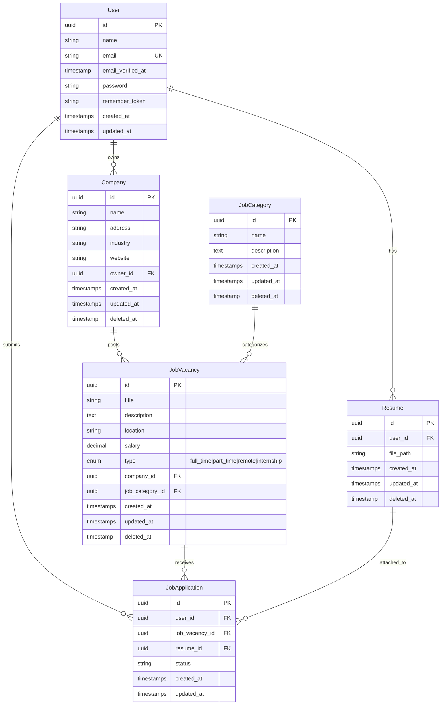

<p align="center">
  
  
  
  
  
</p>

<h1 align="center">🚀 Enterprise Job Board Platform</h1>

<p align="center">
  <strong>A scalable, modular monorepo architecture for a complete job board solution</strong>
</p>

<p align="center">
  <em>Built with separation of concerns, featuring distinct Candidate Portal & Admin Backoffice applications</em>
</p>

---

## 📑 Table of Contents

- [🎯 Overview](#-overview)
- [🏗️ System Architecture](#️-system-architecture)
- [🗂️ Project Structure](#️-project-structure)
- [📊 Entity Relationship Diagram](#-entity-relationship-diagram)
- [💻 Technical Stack](#-technical-stack)
- [⚡ Quick Start](#-quick-start)
- [🔧 Installation & Setup](#-installation--setup)
- [🔑 Key Features](#-key-features)
- [🧪 Quality Assurance](#-quality-assurance)
- [📁 Directory Structure](#-directory-structure)
- [🤝 Contributing](#-contributing)
- [📄 License](#-license)

---

## 🎯 Overview

The **Enterprise Job Board Platform** is a production-ready recruitment solution engineered with a focus on **separation of concerns** and **scalability**. This monorepo houses two independent Laravel applications that share a cohesive ecosystem while maintaining strict logical separation between:

- **Candidate-facing portal** for job discovery and applications
- **Administrative backoffice** for recruiters and platform managers

> [!IMPORTANT]
> This platform uses **UUID-based primary keys** for all entities, ensuring distributed system compatibility and enhanced security.

---

## 🏗️ System Architecture

The platform is architected as **two independent Laravel 12.x applications**:

```
┌─────────────────────────────────────────────────────────────────────┐
│                     Job Board Platform (Monorepo)                    │
├─────────────────────────────────┬───────────────────────────────────┤
│        🌐 Candidate Portal      │      🛡️ Admin Backoffice          │
│           (job-app)             │        (job-backoffice)           │
├─────────────────────────────────┼───────────────────────────────────┤
│ • Job Discovery & Search        │ • Company/Recruiter Management    │
│ • Application Submission        │ • Application Tracking System     │
│ • Profile & Resume Management   │ • Job Vacancy CRUD                │
│ • Authentication (Candidates)   │ • Category & Taxonomy Management  │
│ • Application History           │ • Database Seeding & Admin Tools  │
└─────────────────────────────────┴───────────────────────────────────┘
                                  │
                                  ▼
                    ┌─────────────────────────┐
                    │     Shared Database     │
                    │   (MySQL / MariaDB)     │
                    └─────────────────────────┘
```

### 🌐 Candidate Portal (`/job-app`)

A responsive, user-centric frontend designed for high traffic and engagement.

| Feature | Description |
|---------|-------------|
| **Job Discovery** | Advanced search and filtering capabilities for job vacancies |
| **Application Logic** | Secure handling of resume uploads and job applications |
| **Profile Management** | Self-service dashboard for personal data and application history |
| **Authentication** | Session-based auth via Laravel Breeze |

### 🛡️ Admin Backoffice (`/job-backoffice`)

A restricted-access administrative panel for recruiters and platform managers.

| Feature | Description |
|---------|-------------|
| **Tenant Management** | Full CRUD operations for Companies and Recruiters |
| **ATS Features** | Application Tracking System to review, accept, or reject submissions |
| **Taxonomy Management** | Dynamic control over Job Categories and Attributes |
| **Data Seeding** | Built-in mechanisms to populate the database with initial data |

---

## 🗂️ Project Structure

```
job-board-platform/
├── 📂 job-app/                    # Candidate Portal Application
│   ├── app/
│   │   ├── Http/Controllers/      # Request handlers
│   │   ├── Models/                # Eloquent models (User)
│   │   ├── Providers/             # Service providers
│   │   └── View/                  # View components
│   ├── resources/views/           # Blade templates
│   ├── routes/                    # Web & API routes
│   └── tests/                     # Feature & Unit tests
│
├── 📂 job-backoffice/             # Admin Backoffice Application
│   ├── app/
│   │   ├── Http/Controllers/      # Admin controllers
│   │   ├── Models/                # Core domain models
│   │   │   ├── Company.php
│   │   │   ├── JobApplication.php
│   │   │   ├── JobCategory.php
│   │   │   ├── JobVacancy.php
│   │   │   ├── Resume.php
│   │   │   └── User.php
│   │   ├── Providers/             # Service providers
│   │   └── View/                  # View components
│   ├── database/
│   │   ├── migrations/            # Database schema
│   │   └── seeders/               # Data seeders
│   ├── resources/views/           # Admin Blade templates
│   ├── routes/                    # Admin routes
│   └── tests/                     # Feature & Unit tests
│
└── 📄 README.md                   # This file
```

---

## 📊 Entity Relationship Diagram



---

## 💻 Technical Stack

| Layer | Technology | Version | Purpose |
|-------|------------|---------|---------|
| **Backend Framework** | Laravel | 12.x | Robust MVC architecture with strict typing |
| **Runtime** | PHP | ≥ 8.2 | Modern syntax with attributes, enums, and typed properties |
| **Frontend** | Blade + Tailwind CSS | 3.x | Utility-first styling for rapid UI development |
| **Build Tool** | Vite | 5.x | Next-generation frontend tooling for optimized assets |
| **Database** | MySQL / MariaDB | 8.x+ | Relational data integrity with rigorous FK constraints |
| **Authentication** | Laravel Breeze | 2.3 | Secure session-based authentication |
| **Testing** | PHPUnit | 11.x | Feature & Unit testing framework |
| **Code Style** | Laravel Pint | 1.24 | Opinionated PHP code style fixer |
| **Development** | Laravel Sail | 1.41 | Docker development environment |

### 📦 Key Dependencies

```json
{
  "require": {
    "php": "^8.2",
    "laravel/framework": "^12.0",
    "laravel/tinker": "^2.10.1"
  },
  "require-dev": {
    "laravel/breeze": "^2.3",
    "phpunit/phpunit": "^11.5.3",
    "laravel/pint": "^1.24",
    "laravel/sail": "^1.41"
  }
}
```

---

## ⚡ Quick Start

```bash
# Clone the repository
git clone https://github.com/your-username/job-board-platform.git
cd job-board-platform

# Setup Candidate Portal
cd job-app && composer setup

# Setup Admin Backoffice (with seeding)
cd ../job-backoffice && composer setup
php artisan db:seed
```

---

## 🔧 Installation & Setup

### Prerequisites

| Requirement | Version | Description |
|-------------|---------|-------------|
| PHP | ≥ 8.2 | With required extensions (mbstring, xml, curl, etc.) |
| Composer | Latest | PHP dependency manager |
| Node.js | ≥ 18.x | JavaScript runtime |
| NPM | ≥ 9.x | Node package manager |
| MySQL | ≥ 8.x | Or MariaDB 10.x+ |

### Step 1: Clone the Repository

```bash
git clone https://github.com/your-username/job-board-platform.git
cd job-board-platform
```

### Step 2: Configure the Candidate Portal (`job-app`)

```bash
cd job-app

# Install PHP Dependencies
composer install

# Install Node Dependencies
npm install

# Environment Configuration
cp .env.example .env
php artisan key:generate

# Configure your database in .env file
# DB_CONNECTION=mysql
# DB_HOST=127.0.0.1
# DB_PORT=3306
# DB_DATABASE=job_board
# DB_USERNAME=your_username
# DB_PASSWORD=your_password

# Build Frontend Assets
npm run build

# Run Migrations
php artisan migrate
```

### Step 3: Configure the Admin Backoffice (`job-backoffice`)

```bash
cd ../job-backoffice

# Install PHP Dependencies
composer install

# Install Node Dependencies
npm install

# Environment Configuration
cp .env.example .env
php artisan key:generate

# Build Frontend Assets
npm run build

# Run Migrations with Seeding (Important for Admin Data)
php artisan migrate --seed
```

### Step 4: Run Development Servers

**Option A: Using Composer Scripts (Recommended)**

```bash
# In job-app directory
composer dev

# In job-backoffice directory (separate terminal)
composer dev
```

**Option B: Manual Start**

```bash
# Terminal 1 - Candidate Portal
cd job-app && php artisan serve --port=8000

# Terminal 2 - Admin Backoffice
cd job-backoffice && php artisan serve --port=8001
```

---

## 🔑 Key Features

### Job Vacancy Types

The platform supports multiple employment types:

| Type | Value | Description |
|------|-------|-------------|
| 🏢 **Full-Time** | `full_time` | Standard full-time employment |
| ⏰ **Part-Time** | `part_time` | Part-time positions |
| 🏠 **Remote** | `remote` | Work from anywhere opportunities |
| 🎓 **Internship** | `internship` | Entry-level/training positions |

### Model Features

- ✅ **UUID Primary Keys** - Distributed system ready
- ✅ **Soft Deletes** - Safe data deletion with recovery option
- ✅ **Factory Support** - Easy testing and seeding
- ✅ **Eloquent Relationships** - Well-defined entity relationships
- ✅ **Type Casting** - Automatic attribute casting

---

## 🧪 Quality Assurance

Both applications enforce code quality standards through automated testing and linting.

### Running Tests

```bash
# Using Composer Script
composer test

# Direct PHPUnit
php artisan test

# With Coverage
php artisan test --coverage
```

### Code Style

```bash
# Check code style
./vendor/bin/pint --test

# Fix code style
./vendor/bin/pint
```

### Available Composer Scripts

| Script | Command | Description |
|--------|---------|-------------|
| `setup` | `composer setup` | Full installation process |
| `dev` | `composer dev` | Start development server with queue and Vite |
| `test` | `composer test` | Run test suite |

---

## 📁 Directory Structure

<details>
<summary>📂 <strong>Click to expand full directory structure</strong></summary>

```
job-board-platform/
├── job-app/
│   ├── app/
│   │   ├── Http/
│   │   │   └── Controllers/
│   │   │       ├── Auth/           # Authentication controllers
│   │   │       ├── Controller.php  # Base controller
│   │   │       └── ProfileController.php
│   │   ├── Models/
│   │   │   └── User.php
│   │   ├── Providers/
│   │   └── View/
│   ├── bootstrap/
│   ├── config/
│   ├── public/
│   ├── resources/
│   │   ├── css/
│   │   ├── js/
│   │   └── views/
│   ├── routes/
│   │   ├── web.php
│   │   └── auth.php
│   ├── storage/
│   ├── tests/
│   ├── composer.json
│   ├── package.json
│   ├── tailwind.config.js
│   └── vite.config.js
│
├── job-backoffice/
│   ├── app/
│   │   ├── Http/
│   │   │   └── Controllers/
│   │   │       ├── Auth/           # Authentication controllers
│   │   │       ├── Controller.php  # Base controller
│   │   │       └── ProfileController.php
│   │   ├── Models/
│   │   │   ├── Company.php         # Company entity
│   │   │   ├── JobApplication.php  # Application tracking
│   │   │   ├── JobCategory.php     # Job taxonomies
│   │   │   ├── JobVacancy.php      # Job listings
│   │   │   ├── Resume.php          # Candidate resumes
│   │   │   └── User.php            # User accounts
│   │   ├── Providers/
│   │   └── View/
│   ├── bootstrap/
│   ├── config/
│   ├── database/
│   │   ├── factories/
│   │   ├── migrations/
│   │   └── seeders/
│   ├── public/
│   ├── resources/
│   ├── routes/
│   ├── storage/
│   ├── tests/
│   ├── composer.json
│   ├── package.json
│   ├── tailwind.config.js
│   └── vite.config.js
│
└── README.md
```

</details>

---

## 🤝 Contributing

Contributions are welcome! Please follow these guidelines:

1. **Fork** the repository
2. **Create** a feature branch (`git checkout -b feature/amazing-feature`)
3. **Commit** your changes (`git commit -m 'Add some amazing feature'`)
4. **Push** to the branch (`git push origin feature/amazing-feature`)
5. **Open** a Pull Request

### Commit Convention

We follow [Conventional Commits](https://www.conventionalcommits.org/):

```
feat: add new job search filter
fix: resolve application submission bug
docs: update README installation guide
style: format code with Laravel Pint
refactor: restructure JobVacancy model
test: add unit tests for Resume upload
```

---

## 📄 License

This project is open-sourced software licensed under the **[MIT License](https://opensource.org/licenses/MIT)**.

---

<p align="center">
  <sub>Built with ❤️ using Laravel 12</sub>
</p>
